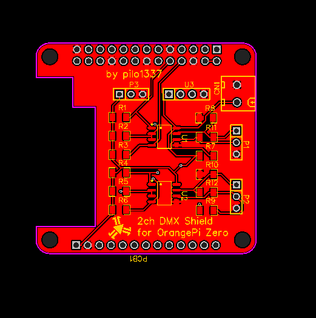
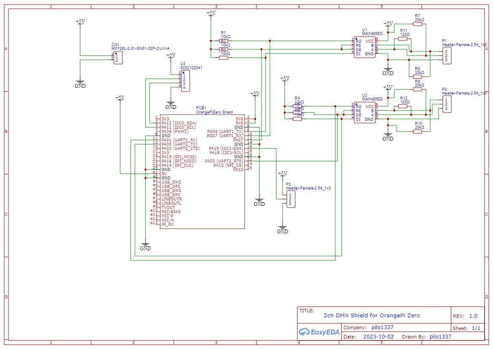
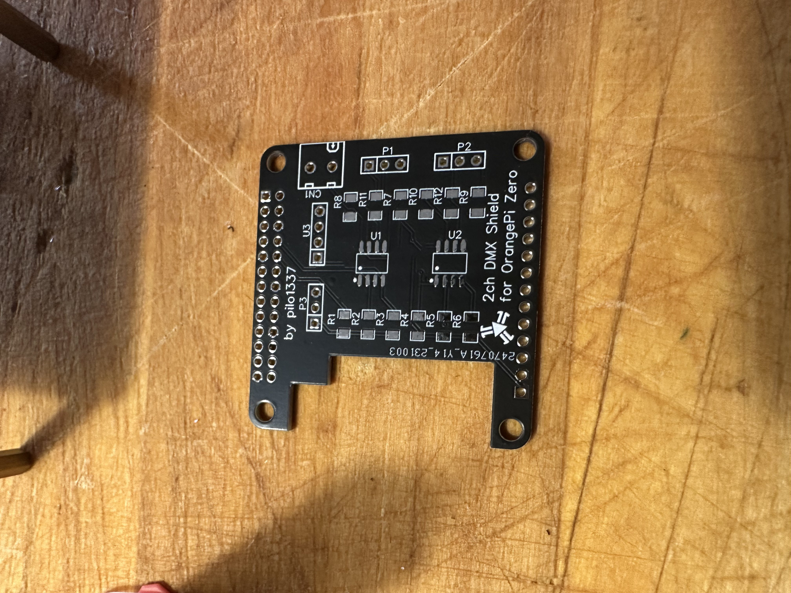
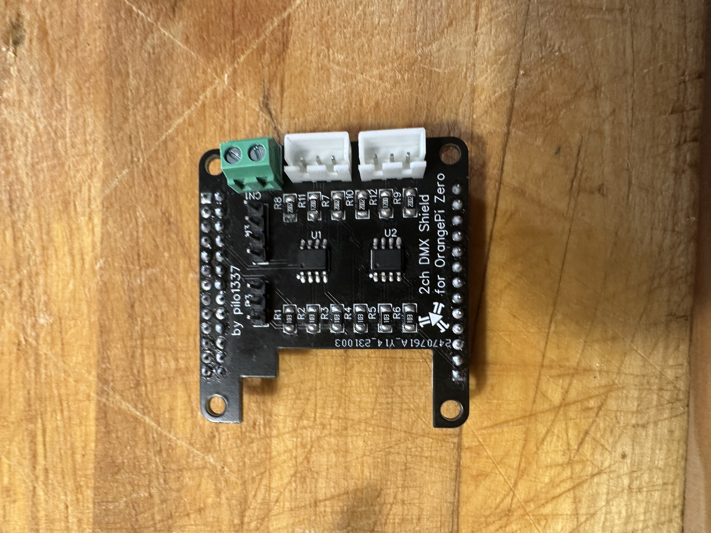
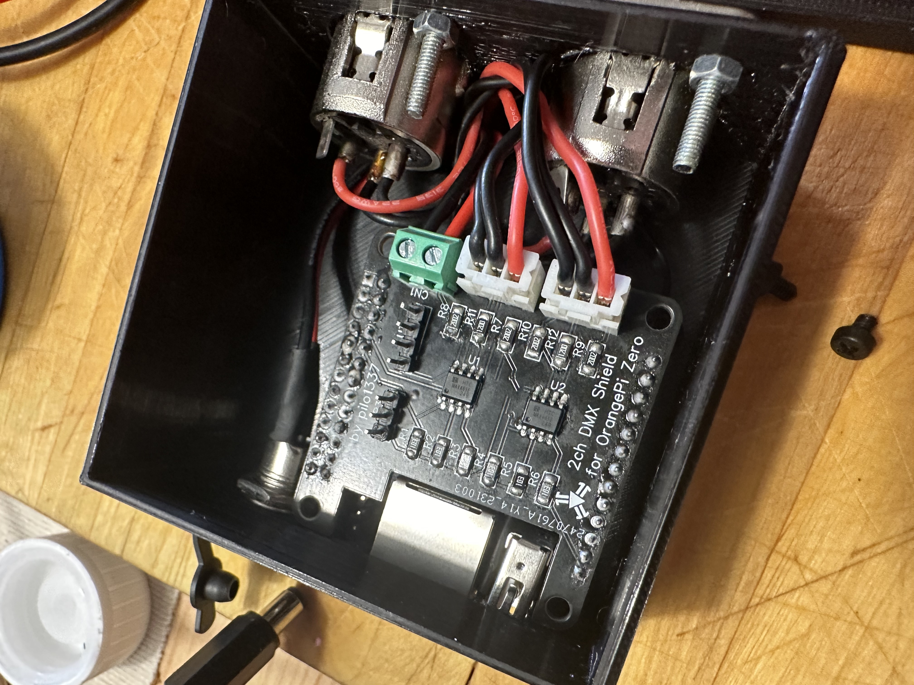
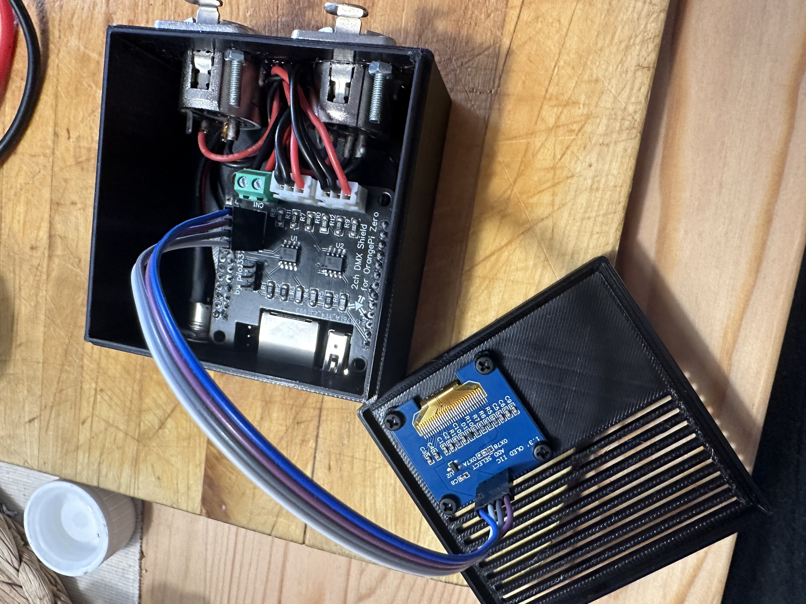
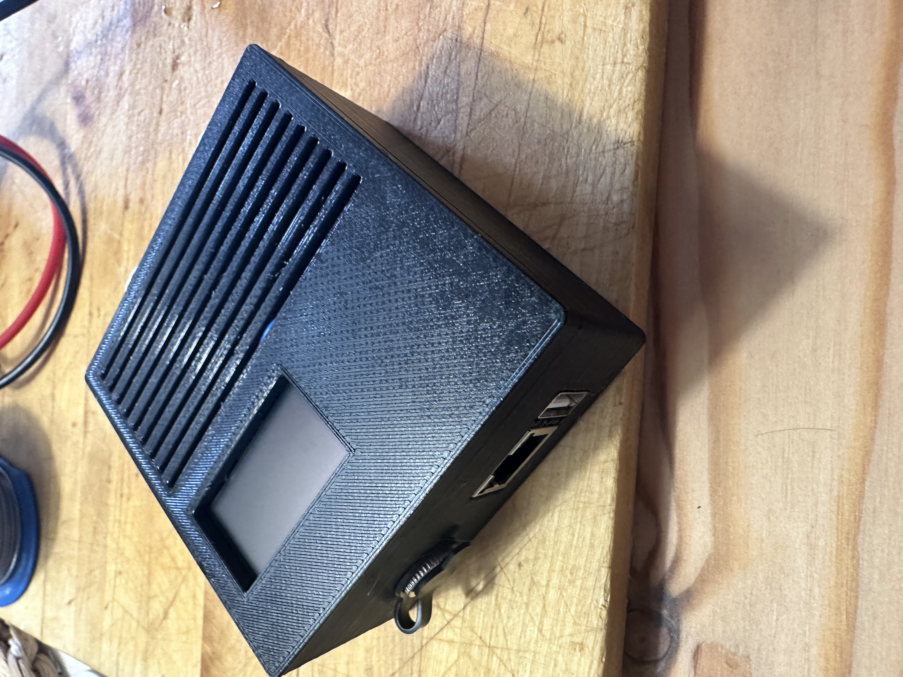
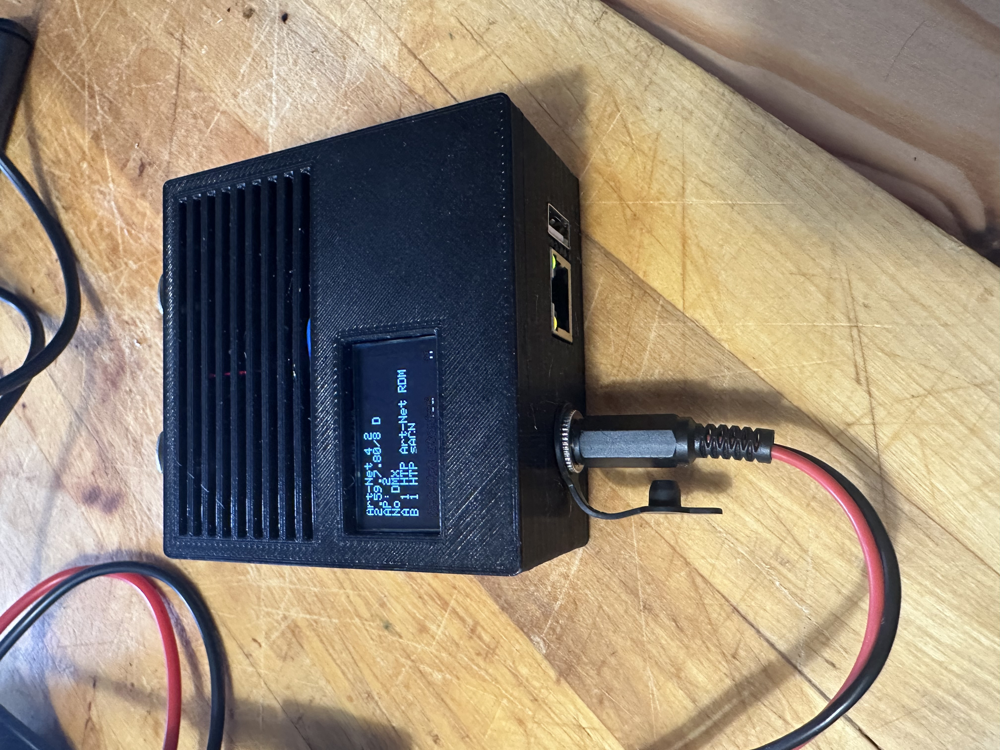
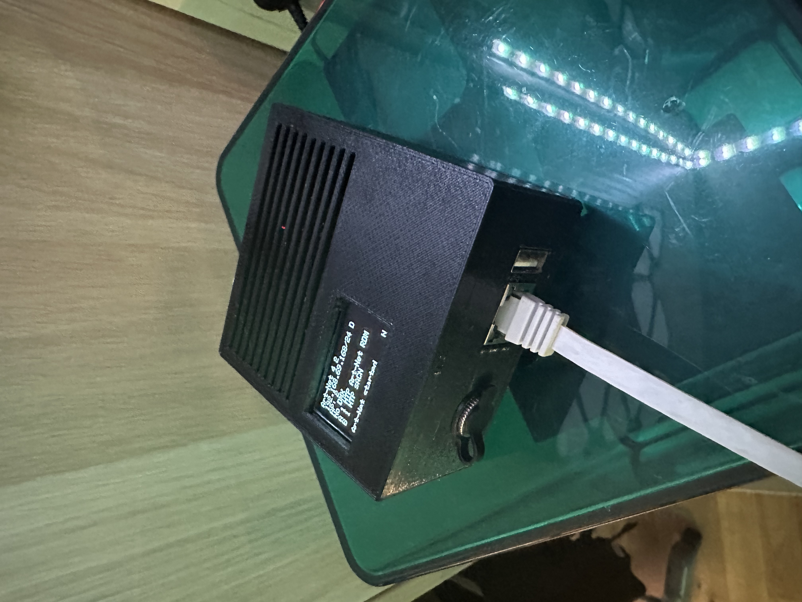
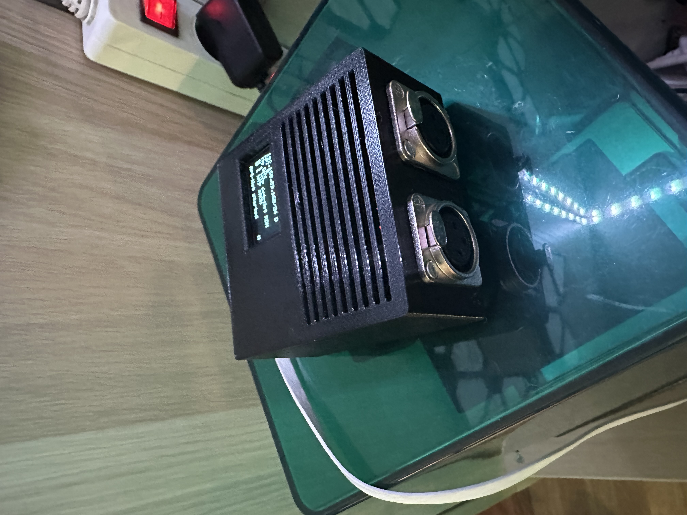

# Orange Pi Zero 2ch DMX Board
This board provides 2 independent DMX in/out Lines for use with OrangePi Zero.
 

## The Board
**Pics**

**Schematic**

**Pinout**

* CN1 is for Power (5V,GND)
	* 1 -> 5V
	* 2 -> GND
* P1 is DMX A
	* 1 -> B -> XLR Pin 2
	* 2 -> A -> XLR Pin 3
	* 3 -> GND -> XLR Pin 1
* P2 is DMX B
	* 1 -> B -> XLR Pin 2
	* 2 -> A -> XLR Pin 3
	* 3 -> GND -> XLR Pin 1
* P3 is for Status LED (this is the Pin from the OrangePi directly! Think about Resistor!)
	* 1 -> 5V
	* 2 -> LED Signal
	* 3 -> GND
* U3 is I2C
	* 1 -> 5V
	* 2 -> SCL
	* 3 -> SDA
	* 4 -> GND
	
**BOM**

BOM is also included, LCSC Parts.
 

## Case
I created a case for the complete interface:

https://github.com/pilo1337/h3dmx512-zip/assets/59642862/fdcd5daf-f60f-4720-9d57-ef3b5007a06b

you will find the files in the STL folder. You can choose between a complete closed lid, slotted lid and a lid with slots/oled display (mine)

 

## assembled

**Board**

**whole interface**

## thanks to @vanvught for this awesome code!
